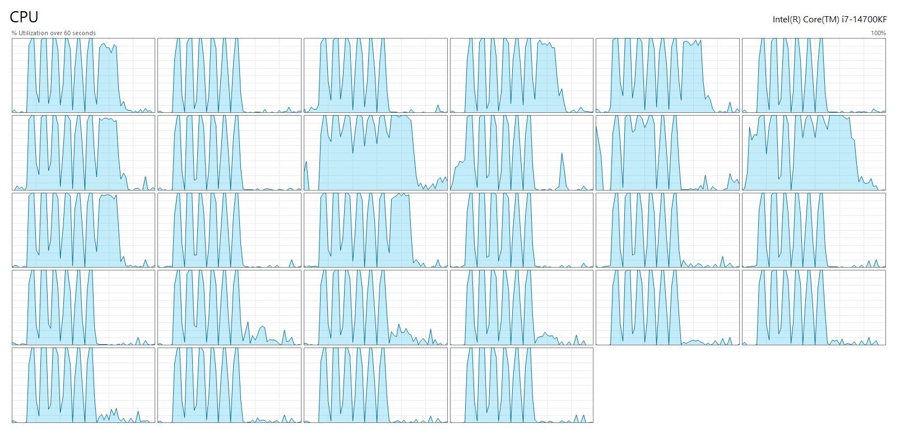

# @krystalmonolith/rx-thread-pool

[](https://www.npmjs.com/package/@krystalmonolith/rx-thread-pool)

## A multi-threading framework melding Node.js Worker Threads and RxJS Observables.
- This library aims to provide a clean, type-safe interface for executing CPU-intensive tasks in parallel using Node.js Worker Threads.
- :exclamation: Multi-threading programming is an advanced skill with significant development risks,
  _and should not be applied trivially_.
- See the GeeksForGeeks.org discussion
  [Difference between Multiprogramming, multitasking, multithreading and multiprocessing](https://www.geeksforgeeks.org/operating-systems/difference-between-multitasking-multithreading-and-multiprocessing/)
  for a comparison of multiple execution strategies.
 
## Installation
```bash
npm install @krystalmonolith/rx-thread-pool
```
## Import
```typescript
import { ThreadTask, ThreadQueue, ThreadPool } from '@krystalmonolith/rx-thread-pool';
```

## Repository

https://github.com/krystalmonolith/rx-thread-pool

## Issues

https://github.com/krystalmonolith/rx-thread-pool/issues

## Requirements

- Node.js >= 16.0.0
- RxJS >= 7.0.0

## Acknowledgments
This project was developed with _significant_ assistance from [Claude](https://claude.ai) (Anthropic).

#### *"ODNT": Old Dogs, New Tricks!*

## Motivation for Developing this Package

- Multi-Threading is a _pain_. Shared Memory. Mutexes. Atomics. Critical Sections. Apartments. :anguished:
- This started is an _experiment_: Could I solve some issues around sharing data between threads on Node.js using RxJS streams?
- Java uses streams and it seems to solve some of same issues: See Oracle's documentation on ["Parallelism"](https://docs.oracle.com/javase/tutorial/collections/streams/parallelism.html).
- In the past I'd worked with functions that took and returned RxJS Observables. Made me think...
- So I wrote the story [doc/ThreadPool.story.txt](doc/ThreadPool.story.txt) as input to Claude. (Took me 45 minutes.)
- The key here is the story line:
`An AbstractThreadTask class is a generic abstract container class for a callback function with signature "threadFunc<T, I extends Observable<T>, V, R extends Observable<V>>(I i, threadId: number):R" .`
- The result I got from Claude was a little more than I bargained for.. But it looked good so I ran with it.

## Features

- 🚀 **Worker Thread Pool**: Automatically manages thread pool based on available CPU cores
- 📦 **Type-Safe**: Full TypeScript support with generics
- 🔄 **RxJS Integration**: Built on RxJS v7 Observables for reactive programming
- 📋 **FIFO Queue**: Multiple task queues with first-in-first-out execution
- ⚡ **Parallel Execution**: Execute multiple tasks concurrently across threads
- 🎯 **Thread Tracking**: Unique thread IDs for monitoring and debugging

## CPUs while performing a 2048x2048 matrix multiplies with different block sizes.



## Background: Node.js Worker Threads

 - [Node.js](https://nodejs.org) worker threads, introduced in the `worker_threads` module, provide true parallel
execution by allowing JavaScript code to run in separate threads, each with its own V8 instance and event loop, while
sharing the same process memory space. 
 - Unlike the main event loop which excels at I/O-bound operations, worker threads
are designed for CPU-intensive tasks like image processing, cryptographic operations, or complex computations that would
otherwise block the single-threaded event loop and degrade application responsiveness. 
 - Workers communicate with the main thread and each other through message passing (similar to Web Workers in browsers) using `postMessage()` and event
listeners, though they can also share memory directly via `SharedArrayBuffer` for more efficient data transfer in
performance-critical scenarios. 
 - Each worker runs in isolation with its own global context, meaning they don't share
variables or closures with the parent thread, but they do share the same process resources like file descriptors. While
worker threads add valuable parallel processing capabilities to Node.js, they introduce overhead from thread creation
and message serialization, so they're most beneficial for computationally expensive operations rather than I/O tasks,
which are already handled efficiently by Node's asynchronous, non-blocking architecture.

## Files in `rx-thread-pool/src`
### Package Source Code
- AbstractThreadTask.ts
- ThreadQueue.ts
- ThreadPool.ts
- worker.js
- index.ts
### Non-Recursive Example and Smoke Test Code
- example/example.ts
- example/advanced-example.ts
### Recursive Example and Stress Test Code
- test/recursive-matrix-multiply.test.ts
  - Writes a small CSV file with a test result summary to the rx-thread-pool directory.
  - Filename: **YYYYMMDDThhmmss**-recursive-matrix-multiply.csv
- test/recursive-merge-sort.test.ts
- test/recursive-tree-traversal.test.ts
- test/run-all-recursive-tests.ts
- test/timestamp.ts


## Core Classes

### class [AbstractThreadTask](src/AbstractThreadTask.ts)

- Abstract base class for creating thread tasks. 
- Contains a callback function (threadFunc) that will be executed in a worker thread.
- See the discussion of [threadFunc](#Thread-Function-Signature) below for more details.

```typescript
class AbstractThreadTask<T, I extends Observable<T>, V, R extends Observable<V>>
```

**Type Parameters:**
- `T` - Input observable value type
- `I` - Input observable type
- `V` - Output observable value type
- `R` - Output observable type

### class [ThreadTask](src/AbstractThreadTask.ts)

Concrete implementation of AbstractThreadTask for creating executable tasks.

```typescript
const task = new ThreadTask(
  (input: Observable<number>, threadId: number) => {
    return input.pipe(
      map(n => n * 2)
    );
  },
  of(1, 2, 3, 4, 5)
);
```

### class [ThreadQueue](src/ThreadQueue.ts)

FIFO queue for managing ThreadTask instances.

```typescript
const queue = new ThreadQueue('my-queue');
queue.enqueue(task1);
queue.enqueue(task2);
```

**Methods:**
- `enqueue(task)` - Add task to queue
- `dequeue()` - Remove and return first task
- `peek()` - View first task without removing
- `isEmpty()` - Check if queue is empty
- `size()` - Get queue size
- `getAllTasks()` - Get all tasks as array
- `clear()` - Remove all tasks

### class [ThreadPool](src/ThreadPool.ts)

Manages a pool of worker threads that execute tasks from queues.

```typescript
const pool = new ThreadPool([queue1, queue2]);
const result$ = pool.start();
```

**Constructor:**
- Takes array of ThreadQueue instances
- Number of threads = `os.availableParallelism()`

**Methods:**
- `start()` - Start executing all tasks, returns Observable\<ThreadResult> or null
  - `start()` returns a cold "output" RxJS observable.
  - If `start()` returns a null value an error occurred starting the pool.
  - The Observable returned by `start()` may also stream error(s).  
  - NOTHING HAPPENS UNTIL the Observable returned `start()` is subscribed!!!
  - Once the Observable returned `start()` is subcribed the "input" Observable(s) will be subscribed.
  - Thread execution **begins** when the "input" Observable associated with the thread's `threadProd` complete!
  - All threads have completed execution when the Observable returned by `start()` completes.
  

- `getMaxThreads()` - Get maximum thread count
  - Number of threads = os.availableParallelism() in the Node.js API
- `getActiveWorkerCount()` - Get current active worker count
- `terminateAll()` - Terminate all active workers

## Thread Function Signature

```typescript
threadFunc<T, I extends Observable<T>, V, R extends Observable<V>>(
  input: I,
  threadId: number
): R
```

**Parameters:**
- `input` - Observable input stream
- `threadId` - Unique identifier for the thread (0, 1, 2, ...)

**Returns:**
- Observable stream of results

## Usage Example

```typescript
import { Observable, of, map } from 'rxjs';
import { ThreadTask, ThreadQueue, ThreadPool } from '@krystalmonolith/rx-thread-pool';

// Create a task with a computation function
const computeTask = new ThreadTask(
  (input: Observable<number>, threadId: number) => {
    return input.pipe(
      map(n => {
        // CPU-intensive calculation
        let result = 0;
        for (let i = 0; i < n; i++) {
          result += Math.sqrt(i);
        }
        return { threadId, input: n, result };
      })
    );
  },
  of(1000000, 2000000, 3000000)
);

// Create another task
const dataTask = new ThreadTask(
  (input: Observable<string>, threadId: number) => {
    return input.pipe(
      map(str => ({
        threadId,
        processed: str.toUpperCase()
      }))
    );
  },
  of('hello', 'world')
);

// Create queues and add tasks
const queue1 = new ThreadQueue('compute-queue');
queue1.enqueue(computeTask);

const queue2 = new ThreadQueue('data-queue');
queue2.enqueue(dataTask);

// Create thread pool
const pool = new ThreadPool([queue1, queue2]);

// Start execution
const result$ = pool.start();

// result$ contains a cold "output" RxJS observable or null.
// NOTHING HAPPENS UNTIL $result is subscribed!!!
// Once $result is subcribed the "input" observable(s) will be subscribed.
// Thread execution *begins* when the "input" observable(s) complete!
if (result$) {
  result$.subscribe({
    next: (result) => {
      if (result.error) {
        console.error(`Thread ${result.threadId} error:`, result.error);
      } else if (result.completed) {
        console.log(`Thread ${result.threadId} completed`);
      } else {
        console.log(`Thread ${result.threadId}:`, result.value);
      }
    },
    complete: () => {
      console.log('All threads completed');
      pool.terminateAll();
    }
  });
}
```

## How It Works

1. **Task Creation**: Create ThreadTask instances with a callback function and input Observable
2. **Queue Management**: Add tasks to ThreadQueue instances using FIFO ordering
3. **Pool Initialization**: Create ThreadPool with array of queues
4. **Execution**: Call `pool.start()` to:
   - Concatenate all tasks from all queues
   - Create a worker thread for each task
   - Assign unique thread ID to each worker
   - Return merged Observable of all results
5. **Result Processing**: Subscribe to the result Observable to handle emissions from all threads

## Thread Results

Each result emitted contains:

```typescript
interface ThreadResult<V> {
  threadId: number;      // Unique thread identifier
  value?: V;             // Result value (if not error/complete)
  error?: string;        // Error message (if error occurred)
  completed: boolean;    // true if thread finished
}
```

## Best Practices

1. **CPU-Intensive Tasks**: Use for computationally expensive operations (image processing, data analysis, encryption)
2. **Avoid I/O**: Node's async model is better for I/O operations
3. **Task Granularity**: Balance task size - too small adds overhead, too large reduces parallelism
4. **Memory Management**: Be mindful of data passed between threads
5. **Error Handling**: Always handle errors in subscription

## Limitations

- Functions passed to workers must be serializable (no closures over external variables)
- Shared memory via SharedArrayBuffer is not tested (yet)... Use RxJS streams to avoid race conditions.
- Worker startup has overhead - Better for longer-running tasks
- IDE Debuggers segfault when breakpoints are in the threaded code... YMMV.

## Building from Source

```bash
npm install
npm run build
```

## Testing

```bash
npm test
```

## License

MIT

## Contributing

Contributions welcome! Please open an issue or PR.
